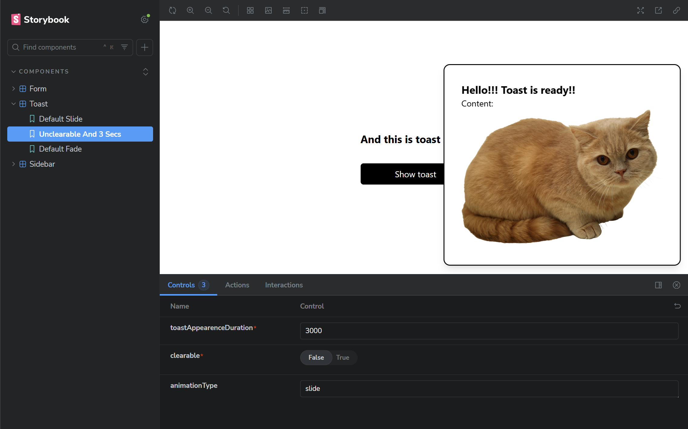

Setup instructions:

1. Initialize project: pnpm install
2. Open dev version of a project locally: pnpm dev
3. Open storybook admin panel: pnpm storybook

Form Text Input Component states:

State 1:
input type = "text"
clearable = false

State 2:
input type = "password"
clearable = true

State 3:
input type = "number"
clearable = false

