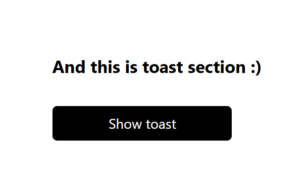

Setup instructions:

1. Initialize project: pnpm install
2. Open dev version of a project locally: pnpm dev
3. Open storybook admin panel: pnpm storybook

Form Text Input Component:

Description:
This is a component that uses react-hook-form. It's quite simple, but also uses FormProvider, to share FormContext. It was probably the easiest one from all of them. It took no more than an hour to complete it (I don't include time spended on configuration of Storybook)

It has 6 state combinations, but I'll show only 3

State 1:
input type = "text"
clearable = false

State 2:
input type = "password"
clearable = true

State 3:
input type = "number"
clearable = false

Toast Component:

Description:
At first it looked like a simple task, but due to fade animation, it was quite complex. Implementation may look simple, so you probably wondering, what was so difficult, but I wasted too much of time figuring out, that I can use decremental z-index to hide Toast component after animation. And it wouldn't be so difficult, if at first I didn't try to fix the bag with Toast flinching on the page after every reload only with CSS.

This component has infinite number of configurations, considering time parameter, but I show you only 3 of them:

State 1:
toastAppearenceDuration = 5 000ms
clearable = true
animationType = slide

State 2:
toastAppearenceDuration = 3 000ms
clearable = false
animatinoType = slide

State 3:

toastAppearenceDuration = 5 000ms
clearable = true
animationType = fade

